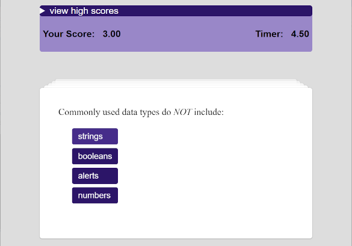
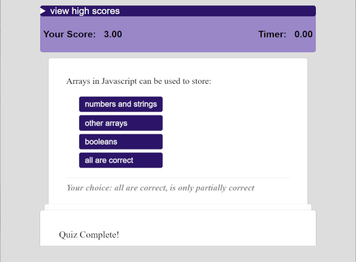
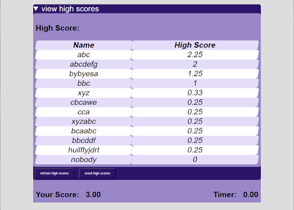

# Quiz Challenge

## Links

Deployed quiz game: [https://andrenrwn.github.io/quizchallenge](https://andrenrwn.github.io/quizchallenge)

Repository: [https://github.com/andrenrwn/quizchallenge](https://github.com/andrenrwn/quizchallenge)

## About

This application implements a question and answer quiz game.
Users click on the "Start the Quiz" button to begin the quiz and start the timer.
Users click on multiple-choice questions, which will be evaluated and added to their score and open the next question card.
A quiz session will end when the time limit expires, or the user reaches the finish card.
Users can enter their initials to record their high score.
Quiz questions are shuffled and presented in random order.

The application demonstrates JavaScript DOM user interface event programming, in which various events, such as user clicks and timer events, are fired onto specific HTML elements and handled by event handlers.

Previous quiz questions and their results are stored in stacked cards. Previous cards can be pulled up to view the results.

## Quiz questions

Quiz questions are stored in the .html itself, under the **#quizdata** main.
    <main id="quizdata">

Question cards are stored in sections with the .quiz class.
Answers are marked with the existence of a data-answer attribute, which is worth 1 point. A data-answer attribute with a value denotes partial credit.

        <section class="quiz">
            
Commonly used data types do <em>NOT</em> include:

            <ul>
                <li>strings</li>
                <li>booleans</li>
                <li data-answer>alerts</li>
                <li>numbers</li>
            </ul>
        </section>

        <section class="quiz">
            
Arrays in Javascript can be used to store:

            <ul>
                <li data-answer="0.25">numbers and strings</li>
                <li data-answer="0.25">other arrays</li>
                <li data-answer="0.25">booleans</li>
                <li data-answer>all are correct</li>
            </ul>
        </section>

## Quiz timer

The quiz needs to be completed within a time limit shown in the countdown timer.
If the countdown timer expires, the quiz ends and the user is presented with the last card.
The quiz time limit is configured in the #timetotal span.
If the user answers incorrectly, the time deduction is set in #timededuct.

        <section class="start">
            <h3>Welcome to the Quiz! Topic: JavaScript</h3>
            Time limit: 30 seconds. 
            Wrong answers deduct 5 seconds. 
            Are you ready?

            <ul>
                <li>Start the quiz</li>
            </ul>
        </section>

## Quiz review

Once a quiz is completed, the user can re-enter their initials.
On clicking "Finish /Review Quiz" the user goes into review mode. In review mode the cards are shrunk and laid out top to bottom and the window scrolls to the opened high score table.
If the user enters an intial, their initals are blinked if it exists in the table.
Clicking the cards in review mode can toggle it back into shuffle mode. Clicking "Finish / Review Quiz" brings it back again to review mode.
The user can click on "Take Another Quiz" or refresh the screen to start a new quiz session.

## High Scores

High scores are stored in the browser's localstorage.
A top high score is kept for all users, including those who don't enter initials.
High scores are kept for each user initial.
The high score table can be cleared with **reset high scores** button.
You can debug this with the browser's dev tools (F12), go to Applications -> Storage -> Local Storage -> highscores to manage the records.

## Credits

Pullup cards are a modification of colin's codepen:
https://codepen.io/colin/pen/bdxoZL

Accordion animation (used for the "view high scores" summary) incorporated Mamboleoo's codepen:
https://codepen.io/Mamboleoo/pen/QWEpLqm

Color palette:
https://paletton.com/#uid=54h0u0kowpcbHF6iItiszj4D7b-

## Others

I previously used a different presentation approach to hide the div cards and make them appear one by one. You can see this alternative code in the scrath/perspective folder.
https://andrenrwn.github.io/quizchallenge/scratch/perspective
